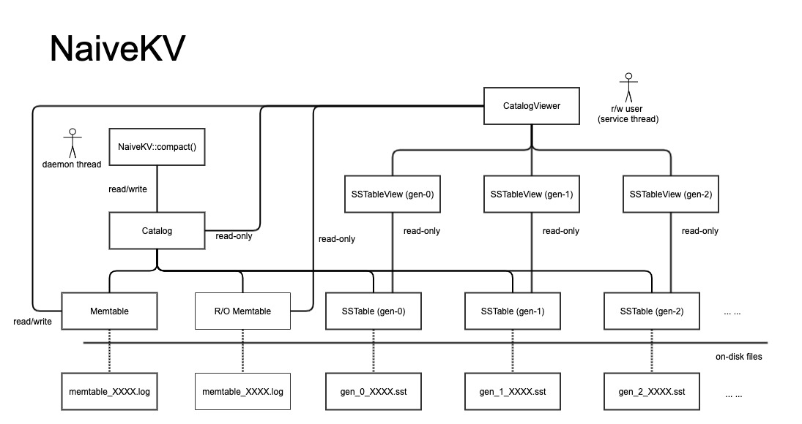
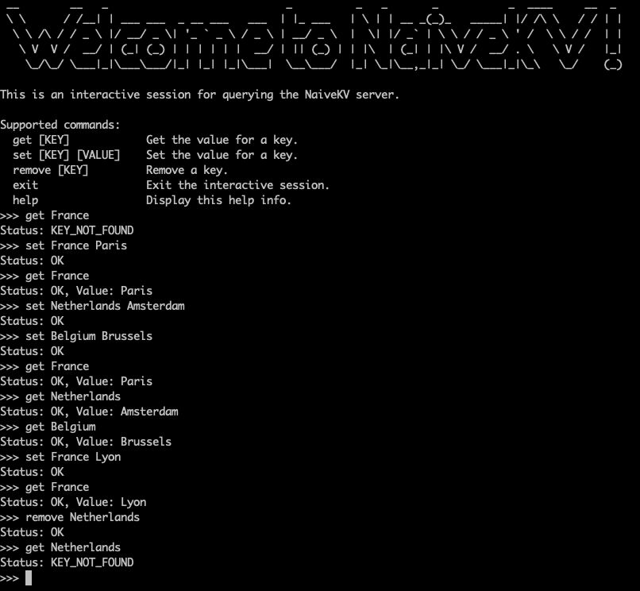

# NaiveKV: A Log Structured Storage Engine

A KV storage engine that is <i>too young, too simple, sometimes naive</i>. 🐸

It might not be as fast as HK reporters, though.
I just created this toy project to familiar myself with Rust,
and barely did any profiling or optimization yet.
So don't take this too seriously.

NaiveKV adopts the idea of
[SSTables](https://www.igvita.com/2012/02/06/sstable-and-log-structured-storage-leveldb/)
instead of the hash index,
so that the in-memory index structure doesn't need to hold all the keys.
Hot data is first written into an in-memory data structure with a redo log,
and periodically gets merged into immutable segment files by a daemon thread.

## Structure

`src/bin/run_server.rs`: A multithreaded TCP server based on the NaiveKV storage engine.

`src/bin/run_client.rs`: An interactive client taking commands from a shell and talking with the TCP server.

`src/lib.rs`: The facade of the NaiveKV storage engine.

`src/catalog.rs`: A data structure maintaining all the in-memory and on-disk data.

`src/sstable.rs`: The Sorted Sring Table, which stores sorted key value pairs in an immutable file and keeps an in-memory B-tree index.

`src/memtable.rs`: A data structure for in-memory active data with write-ahead logs.

`src/thread_pool.rs`: A very simple thread pool with FIFO scheduling policy.

`src/logger.rs`: A very simple logger based on the log crate.

`src/utils.rs`: Some utility functions, mostly about serialization and deserialization.

`src/types.rs`: Some common types used throughout the system.

`src/protos/messages.proto`: The schemas of messages for client-server interaction and data persistence.




## Run the Program

To start the server with 5 worker threads on the localhost:

```
  cargo run --release --bin run_server -- --directory /tmp/naive_kv/ --workers 5 --ip 127.0.0.1 --port 1024
```

To start an interactive session to talk to the local server:

```
  cargo run --release --bin run_client -- --ip 127.0.0.1 --port 1024
```


